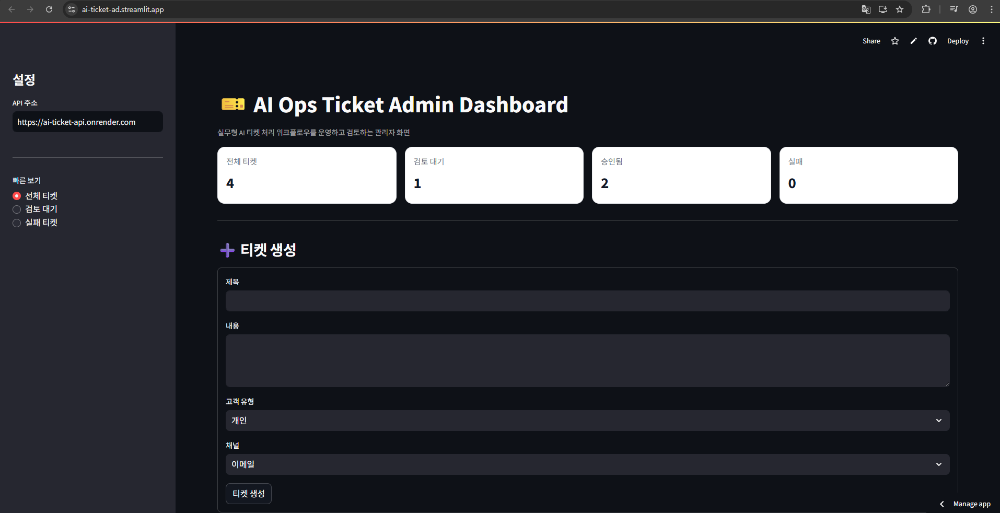

# 🎫 AI Ops Ticket Agent

AI가 고객 문의를 자동으로 처리하고,
사람이 검토·승인·수정하는 실무형 티켓 처리 에이전트 시스템입니다.

단순한 AI 응답 생성이 아닌,
분석 → 분류 → 생성 → 검증 → 사람 검토 → 재작성까지 포함한
워크플로우 기반 운영 시스템을 구현했습니다.

---

## 🚀 프로젝트 소개

이 프로젝트는 고객 문의 처리 업무를 자동화하면서도,
AI 결과를 그대로 사용하지 않고 사람의 검토를 포함한 안정적인 운영 구조를 만드는 것을 목표로 했습니다.

기존 AI 기반 고객 응대 시스템의 문제였던:

불안정한 응답 품질
검증 없는 자동 응답
운영자가 개입할 수 없는 구조

를 해결하기 위해,
Human-in-the-loop 기반 AI Workflow 시스템으로 설계했습니다.

---

## ❗ 문제 정의

일반적인 AI 고객 응대 시스템은 다음과 같은 한계를 가집니다:

한 번의 응답 생성으로 끝나는 구조 (품질 불안정)
잘못된 응답을 그대로 전달할 위험
운영자가 개입할 수 없는 자동화 구조
상태 관리 및 흐름 제어 부재

---

## 💡 해결 방법

이 프로젝트는 다음과 같은 워크플로우로 문제를 해결합니다:

티켓 생성
→ 요청 분석 / 분류
→ 컨텍스트 검색
→ 답변 생성
→ 응답 검증
→ 사람 검토 (승인 / 반려)
→ 재작성 (필요 시)
→ 최종 응답 확정

👉 AI + 사람 협업 구조 (Human-in-the-loop)

---

## 🎯 주요 기능

### 1. 티켓 생성

- 고객 문의를 티켓 형태로 저장
- 채널 / 고객 유형 기반 관리

### 2. 자동 분류 (Classification)

- 문의 내용을 분석하여
- 카테고리 (billing / technical / general)
- 우선순위 (low / medium / high)
- 자동 결정

### 3. 컨텍스트 검색 (Retrieval)

- FAQ / 내부 데이터 기반 정보 검색
- 답변 품질 향상

### 4. 답변 생성 (Draft Generation)

- LLM 기반 자동 응답 생성
- 고객 상황에 맞는 자연어 답변 생성

### 5. 검증 (Validation)

- 생성된 답변을 구조화된 기준으로 평가
- 위험도 / 품질 / human review 필요 여부 판단

### 6. Human Review (핵심🔥)

- 운영자가 직접:
- 승인 (approve)
- 반려 (reject)
- AI 결과를 그대로 사용하지 않음

### 7. 재작성 (Redraft)

- 반려된 답변을 기반
- 개선된 응답 재생성
- 기존 맥락 유지 + 품질 개선

### 8. 상태 기반 워크플로우

- 각 티켓은 상태를 가지며 흐름이 제어됨

created
→ waiting_human_review
→ approved / rejected
→ redraft → 재검증
→ completed

### 9. 관리자 UI (Streamlit)

- 티켓 생성 / 조회 / 필터링
- 승인 / 반려 / 재작성
- 상태 기반 액션 제어
- 로그 / 에러 확인

---

## 🧠 시스템 아키텍처
[Streamlit UI]
        ↓
[FastAPI Server]
        ↓
[LangGraph Workflow Engine]
        ↓
[PostgreSQL DB]

---

## 🔄 워크플로우 구조
기본 처리 흐름:
- classify → retrieve → draft → validate → finalize

재작성 흐름:
- retrieve → redraft → validate → finalize

👉 상태 기반 + 분기 처리 구조

---

## 🧰 기술 스택

### Backend

- Python
- FastAPI
- SQLAlchemy
- PostgreSQL (Render)

### AI / Workflow

- OpenAI API
- LangGraph
- Custom Agent Architecture

### Frontend (1차)

- Streamlit (Admin UI)

### 배포

- Render (FastAPI + DB)
- Streamlit Community Cloud

---

## 📂 프로젝트 구조
```text
ai-ops-ticket-agent/
│
├─ app/
│  ├─ api/
│  ├─ agents/
│  ├─ core/
│  ├─ db/
│  ├─ models/
│  ├─ repositories/
│  ├─ schemas/
│
├─ streamlit_app.py
├─ requirements.txt
├─ .env
```

---

## ⚙ 실행 방법

### 1. 저장소 클론

    git clone https://github.com/Limzzi/ai-ops-ticket-agent.git
    cd ai-ops-ticket-agent

### 2. 가상환경 생성

    python -m venv venv
    source venv/bin/activate  # mac/linux
    venv\Scripts\activate     # windows

### 3. 패키지 설치

    pip install -r requirements.txt

### 4. `.env` 파일 생성

    프로젝트 루트에 `.env` 파일을 생성한 뒤 아래 내용을 입력합니다.

    OPENAI_API_KEY=your_api_key_here
    DATABASE_URL=your_db_url

### 6. 앱 실행

    uvicorn app.main:app --reload
    streamlit run streamlit_app.py

---

## 🌐 배포 링크

- FastAPI: https://ai-ticket-api.onrender.com
- Streamlit: https://ai-ticket-ad.streamlit.app

---

## 📸 실행 화면

### 📌 1. 메인 화면



---

## 🧪 핵심 구현 포인트

### 1. 상태 기반 워크플로우 설계

- 하나의 WorkflowState로 전체 흐름 관리
- 단계별 결과 누적

### 2. Human-in-the-loop 구조

- AI → 검증 → 사람 승인
- 실무 운영 구조 반영

### 3. LangGraph 기반 흐름 제어

- 노드 기반 워크플로우
- 조건 분기 (validation → finalize / retry)

### 4. 재작성 시스템 (Redraft)

- 기존 응답 + 리뷰 코멘트 기반 개선
- context 재조회 포함

### 5. DB + 상태 동기화

- WorkflowState ↔ DB 저장 구조 설계
- 상태 불일치 문제 해결

---

## ⚠ 트러블슈팅

### 1. Python 3.14 배포 실패

→ 해결: Python 3.11로 고정

### 2. DB 연결 문제

→ 해결: Render Internal URL + psycopg

### 3. Redraft 실패

→ 해결: retrieve 단계 재실행 추가

---

## 📈 향후 개선 계획

- React + Next.js 기반 운영 UI
- 인증 / 권한 시스템
- SLA 기반 자동 처리
- 벡터 DB 기반 검색 (RAG)
- 멀티 에이전트 구조 확장

---

## 🧠 배운 점

- 단순 AI 호출이 아닌 워크플로우 기반 설계
- 상태 기반 시스템의 중요성
- AI + 인간 협업 구조 설계
- 실서비스 배포 경험 (Render, Streamlit)

---

## ✨ 프로젝트를 만든 이유

단순히 AI를 사용하는 것이 아니라,
**실제로 운영 가능한 시스템을 직접 설계하고 싶어서 시작했습니다.**

---

## 👨‍💻 작성자

GitHub: https://github.com/Limzzi